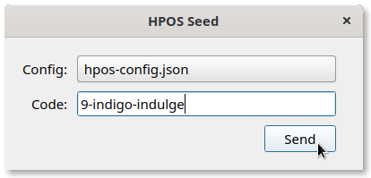

Overview
========

*HPOS Seed* is a library and a suite of tools designed to easily and securely
transmit ``hpos-config.json`` from user's primary device over to their
HoloPortOS instance without having direct USB access.

`Magic Wormhole <https://github.com/warner/magic-wormhole>`_ is the core of
*HPOS Seed* and enables establishing an end-to-end encrypted channel between
the two devices with a short shared code, without any additional configuration,
all while being secure against brute-force attacks.

Also see `HPOS Config <https://github.com/Holo-Host/hpos-config>`_.

Library
-------

.. mermaid::

   sequenceDiagram
      receive()-->>send(): wormhole code
      send()->>receive(): data
      receive()->>send(): ack

*HPOS Seed* protocol is similar to Magic Wormhole text transfer protocol, other
than that receiver is the one allocating wormhole code, and data is sent as
:class:`bytes`.

Read `Magic Wormhole docs <https://magic-wormhole.readthedocs.io>`_ and watch
`PyCon 2016 talk <https://youtu.be/oFrTqQw0_3c>`_ to learn more.

.. module:: hpos_seed

.. autofunction:: receive

.. autofunction:: send

CLI
---

.. asciinema:: cli-demo.cast
   :preload: 1

- ``hpos-seed-receive`` prints wormhole code to :data:`sys.stderr` and, once
  transfer is complete, data to :data:`sys.stdout`.

- ``hpos-seed-send <wormhole_code> <config_path>`` sends config file contents
  to recevier with matching wormhole code.

Desktop app
-----------

*HPOS Seed* includes a cross-platform sender desktop app.

Download the latest stable version at `GitHub Releases
<https://github.com/Holo-Host/hpos-seed/releases>`_.
